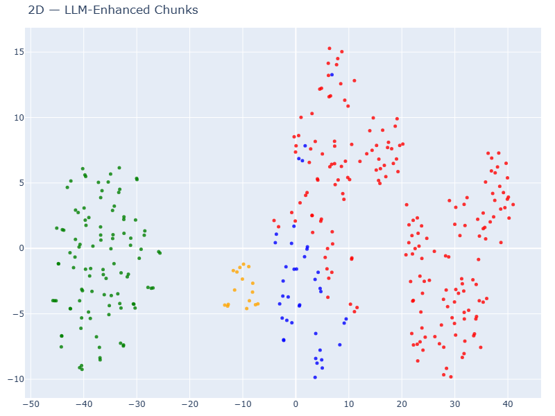
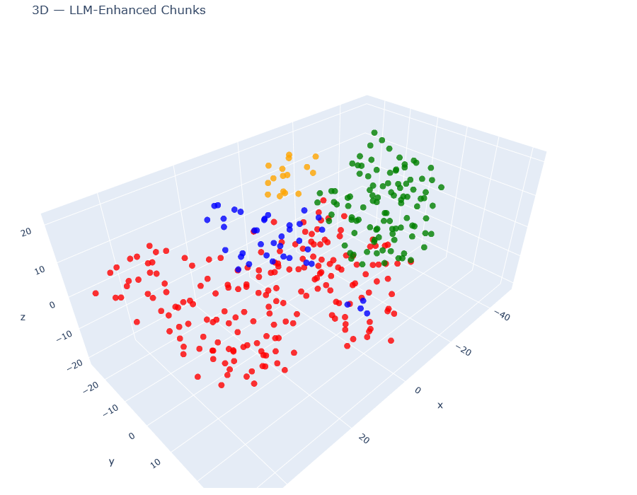
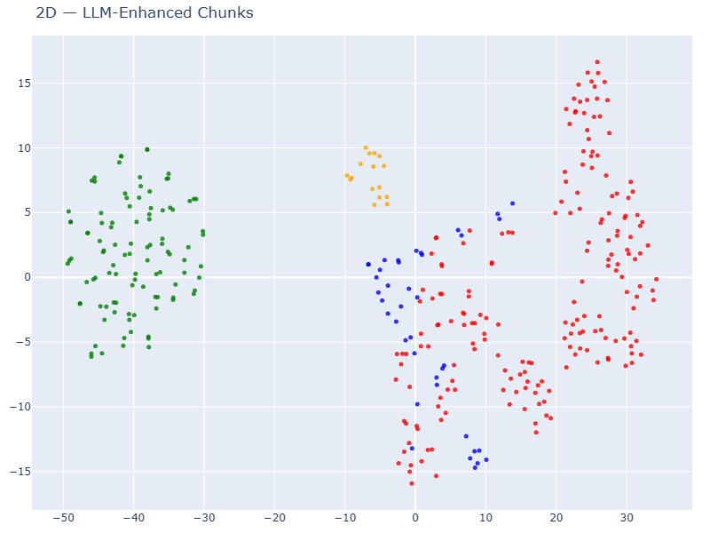
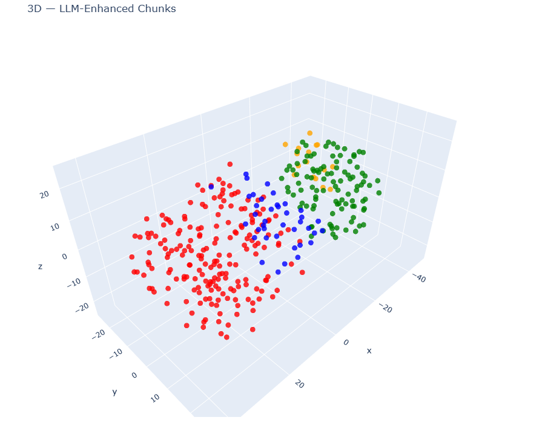

# RAG Workbench

Most teams adopting RAG do it ad hoc — pick a library, build something, ship it. No baseline, no benchmark, no understanding of whether a different configuration would have produced significantly better results. Decisions are made on intuition and the findings don't transfer to the next project.

This workbench exists to fix that. It is a six-phase framework for systematically discovering and optimizing the best RAG pipeline configuration for a given knowledge base. The key idea is simple: **define what good performance looks like before any technical work begins**, establish a measurable baseline, then improve on it in a structured way and show the difference.

The methodology separates exploration (notebooks, fast and disposable) from commitment (structured Python, measurable against a fixed benchmark), and ends with a direct, quantified comparison between the baseline and the optimized pipeline — something you can show to a technical team or a stakeholder.

Built around **Insurellm** — a fictional insurance company with 76 markdown documents covering company info, products, employees, and contracts.

**This repo is a template, not a finished product.** The structure and code are here for you to replicate in your own projects — swap in your own knowledge base, run the phases, and see what configuration works best for your data.

---

## What this demonstrates

| Concept | Where to find it |
|---|---|
| Full RAG pipeline (chunk → embed → retrieve → generate) | `phase3_baseline/implementation/` |
| Multi-provider LLM switching (OpenAI / Anthropic / Gemini) | `phase5_optimized/implementation/answer.py` — `MODEL` + `BASE_URL` |
| Retrieval optimisation: query rewriting + multi-pass + LLM reranking | `phase5_optimized/implementation/answer.py` — `fetch_context()` |
| LLM-based chunking with structured output (Pydantic) | `phase5_optimized/implementation/ingest.py` |
| LLM-as-judge evaluation + retrieval metrics (MRR, nDCG) | `phase3_baseline/implementation/evaluate.py` |
| Gradio evaluation dashboard with colour-coded scoring | `phase3_baseline/evaluator.py` |
| Prompt engineering: grounding, query rewriting, reranking | `phase5_optimized/implementation/answer.py` |

---

## The Six Phases

| Phase | Type | Output |
|-------|------|--------|
| 1 — Define Benchmark | Human work | `data/tests.jsonl` (150 Q&A pairs, locked) |
| 2 — Explore the Data | Notebook | t-SNE visualisations, embedding model comparison |
| 3 — Build LangChain MVP | Python + Gradio | Baseline chat app + evaluation dashboard |
| 4 — Explore Custom Configs | Notebook | LLM chunking, reranking, query rewriting experiments |
| 5 — Build Custom MVP | Python + Gradio | Optimised app + improved benchmark score |
| 6 — Report Results | Written | Quantified comparison of baseline vs optimised |

---

## Setup

**Prerequisites:** Python 3.11+, [uv](https://docs.astral.sh/uv/), OpenAI API key

```bash
uv sync
cp .env.example .env
# Add your OPENAI_API_KEY to .env
```

---

## Phase 1 — Define the Benchmark

No code. Before any technical work, we read the knowledge base as humans and write 150 representative questions and reference answers. These are locked into `data/tests.jsonl` and never changed — every configuration across all phases is measured against the same standard.

See [`docs/benchmark-generation.md`](docs/benchmark-generation.md) for how the benchmark was generated and how to adapt it for a new knowledge base.

---

## Phase 2 — Explore the Data

```bash
uv run jupyter lab
# open notebooks/phase2_exploration.ipynb
```

Chunks and embeds the knowledge base, then visualises the vector space with t-SNE to understand cluster structure before building anything. We tested three embedding models:

| Model | Dims | 2D t-SNE | 3D t-SNE |
|-------|-----:|----------|----------|
| `all-MiniLM-L6-v2` | 384 |  |  |
| `text-embedding-3-small` | 1,536 |  |  |
| `text-embedding-3-large` | 3,072 |  |  |

Colors: blue=products, green=employees, red=contracts, orange=company

See [`docs/phase_2_embedding_progression.md`](docs/phase_2_embedding_progression.md) for the full model comparison log.

---

## Phase 3 — Baseline Pipeline

Migrates the best Phase 2 configuration into structured Python. Uses LangChain with `RecursiveCharacterTextSplitter` (1000 chars, 200 overlap), `text-embedding-3-large`, and `gpt-4.1-mini`.

```bash
# 1. Ingest knowledge base → creates phase3_baseline/vector_db/
uv run python -m phase3_baseline.implementation.ingest

# 2. Launch the chat UI
cd phase3_baseline && uv run python app.py

# 3. Evaluate a single test (0-indexed)
uv run python -m phase3_baseline.implementation.evaluate 0

# 4. Launch the evaluation dashboard (all 150 tests)
cd phase3_baseline && uv run python evaluator.py
```


### Evaluation Metrics

Both Phase 3 and Phase 5 are scored against the same fixed benchmark, making results directly comparable.

| Metric | What it measures |
|--------|-----------------|
| **MRR** (Mean Reciprocal Rank) | Average rank of first keyword occurrence across retrieved docs |
| **nDCG** (Normalised Discounted Cumulative Gain) | Ranking quality using binary keyword relevance |
| **Keyword Coverage** | % of expected keywords found in top-10 retrieved docs |
| **Accuracy** (1–5) | LLM-as-judge: factual correctness vs reference answer |
| **Completeness** (1–5) | LLM-as-judge: coverage of all aspects of the reference answer |
| **Relevance** (1–5) | LLM-as-judge: how directly the question is answered |

---

## Phase 4 — Explore Custom Configurations

```bash
uv run jupyter lab
# open notebooks/phase4_exploration.ipynb
```

Armed with a baseline score, we return to a notebook to test techniques beyond LangChain's defaults:

- **LLM-based chunking** — AI generates a headline, summary, and preserves original text for each chunk, making retrieval more semantically precise
- **Query rewriting** — the user's conversational question is reformulated into a precise KB search query before retrieval
- **Reranking** — after vector retrieval, a second LLM call re-orders results by true relevance to the question
- **Multi-pass retrieval** — retrieves on both the original and rewritten query, merges and deduplicates before reranking

### LLM-Enhanced Chunk Embeddings (t-SNE)

These visualise the vector space after LLM-based chunking — each chunk carries a headline, summary, and original text, so the embedding space is denser and semantically richer than the plain-text chunks in Phase 2.

| Model | Dims | 2D t-SNE | 3D t-SNE |
|-------|-----:|----------|----------|
| `text-embedding-3-small` | 1,536 |  |  |
| `text-embedding-3-large` | 3,072 |  |  |

Colors: blue=products, green=employees, red=contracts, orange=company

---

## Phase 5 — Optimized Pipeline

Builds the best configuration found in Phase 4 into the same structure as Phase 3 — same Gradio interface, same benchmark, same evaluation logic. The only thing that changes is the pipeline.

```bash
# 1. Ingest knowledge base → creates phase5_optimized/preprocessed_db/
#    (slow — each document is processed by an LLM)
uv run python -m phase5_optimized.implementation.ingest

# 2. Launch the chat UI
cd phase5_optimized && uv run python app.py

# 3. Evaluate a single test
uv run python -m phase5_optimized.implementation.evaluate 0
```

---

## Phase 6 — Report Results

With two complete systems and two benchmark scores, the final phase is a written report covering: what the knowledge base looked like, what the baseline produced and where it fell short, which configurations were tested and why, and a direct comparison of scores between Phase 3 and Phase 5.

See [`docs/methodology.md`](docs/methodology.md) for the full six-phase framework and what success looks like.

---

## Project Structure

```
rag-workbench/
├── knowledge-base/          # 76 markdown documents (source of truth)
│   ├── company/
│   ├── contracts/
│   ├── employees/
│   └── products/
├── data/
│   ├── tests.jsonl          # 150 benchmark Q&A pairs (never modify)
│   └── generate_tests.py
├── notebooks/
│   ├── phase2_exploration.ipynb
│   └── phase4_exploration.ipynb
├── phase3_baseline/         # LangChain baseline pipeline
│   ├── app.py
│   ├── evaluator.py
│   └── implementation/
│       ├── ingest.py
│       ├── answer.py
│       └── evaluate.py
├── phase5_optimized/        # Custom advanced pipeline
│   ├── app.py
│   └── implementation/
│       ├── ingest.py
│       ├── answer.py
│       └── evaluate.py
├── assets/
│   ├── phase2/              # t-SNE visualisations (plain chunks, 3 embedding models)
│   ├── phase3/              # UI screenshots
│   ├── phase4/              # t-SNE visualisations (LLM-enhanced chunks)
│   └── phase5/              # UI screenshots
├── docs/
│   ├── methodology.md
│   ├── benchmark-generation.md
│   └── phase_2_embedding_progression.md
├── pyproject.toml
└── .env.example
```

---

## Further Reading

- [`docs/methodology.md`](docs/methodology.md) — the full six-phase framework: rationale, organisational context, and what success looks like
- [`docs/benchmark-generation.md`](docs/benchmark-generation.md) — how the benchmark was generated and how to adapt it for a new knowledge base
- [`docs/phase_2_embedding_progression.md`](docs/phase_2_embedding_progression.md) — embedding model comparison log from Phase 2

---

## Acknowledgements

This project draws heavily on ideas and structure from [Ed Donner's llm_engineering repository](https://github.com/ed-donner/llm_engineering/tree/main/week5), which was a genuinely helpful example of how to build and evaluate a RAG pipeline end to end. I've adapted, extended, and restructured it here for my own use cases and learning.
